# 🏗️ Software Architecture Document (SAD)
## AI Personalized Virtual Guide for Students

**Project Title:** AI Personalized Virtual Guide for Students  
**System Architecture Level:** Enterprise / Production-Grade AI System  
**Author / Senior Architect:** Senior AI & Software Architect  
**Version:** 1.0.0  
**Date:** August 2, 2026  

---

## 📋 Table of Contents
1. [Executive Summary & System Overview](#1-executive-summary--system-overview)
2. [High-Level System Architecture](#2-high-level-system-architecture)
3. [Detailed Component Architecture](#3-detailed-component-architecture)
4. [Frontend Architecture](#4-frontend-architecture)
5. [Backend Architecture](#5-backend-architecture)
6. [Authentication & Authorization Flow](#6-authentication--authorization-flow)
7. [AI Processing Pipeline](#7-ai-processing-pipeline)
8. [RAG Pipeline (PDF → Vector Search → LLM)](#8-rag-pipeline-pdf--vector-search--llm)
9. [Voice Processing Pipeline (STT → LLM → TTS)](#9-voice-processing-pipeline-stt--llm--tts)
10. [Interview Evaluation Pipeline](#10-interview-evaluation-pipeline)
11. [Notes & Mind Map Generation Flow](#11-notes--mind-map-generation-flow)
12. [Dashboard Analytics Flow](#12-dashboard-analytics-flow)
13. [MongoDB Database Schema & ER Diagram](#13-mongodb-database-schema--er-diagram)
14. [API Flow & Endpoints Specification](#14-api-flow--endpoints-specification)
15. [End-to-End Sequence Diagram](#15-end-to-end-sequence-diagram)
16. [Data Flow Diagrams (DFD Level 0 & Level 1)](#16-data-flow-diagrams-dfd-level-0--level-1)
17. [Feature-by-Feature Deep Dive (9 Core Features)](#17-feature-by-feature-deep-dive)
    - [17.1 AI Voice Chatbot with Personalized Conversations](#171-ai-voice-chatbot-with-personalized-conversations)
    - [17.2 Speech-to-Text (Web Speech API)](#172-speech-to-text-web-speech-api)
    - [17.3 Text-to-Speech (Sarvam AI Bulbul v2)](#173-text-to-speech-sarvam-ai-bulbul-v2)
    - [17.4 PDF Upload & RAG Question Answering](#174-pdf-upload--rag-question-answering)
    - [17.5 1-Page Textbook Notes Generator](#175-1-page-textbook-notes-generator)
    - [17.6 Mermaid Mind Map Generator](#176-mermaid-mind-map-generator)
    - [17.7 Top 5 PYQs (Practice Questions) Generator](#177-top-5-pyqs-practice-questions-generator)
    - [17.8 AI Interview Simulator (Technical, HR, Aptitude)](#178-ai-interview-simulator-technical-hr-aptitude)
    - [17.9 Dashboard Analytics & Progress Tracking](#179-dashboard-analytics--progress-tracking)
18. [Folder Structure & Architectural Mapping](#18-folder-structure--architectural-mapping)
19. [Deployment & Infrastructure Architecture](#19-deployment--infrastructure-architecture)
20. [Technology Choice & Trade-Off Analysis](#20-technology-choice--trade-off-analysis)
21. [Bottleneck Analysis & Optimization Strategies](#21-bottleneck-analysis--optimization-strategies)
22. [Production Readiness & Scalability Roadmap](#22-production-readiness--scalability-roadmap)

---

## 1. Executive Summary & System Overview

The **AI Personalized Virtual Guide for Students** is a next-generation, intelligent learning management and viva preparation platform engineered to transform passive study material into active, personalized, and interactive audio-visual learning experiences.

The platform addresses core student learning challenges:
1. Information overload from lengthy engineering textbooks and PDFs.
2. Lack of real-time, interactive oral exam (Viva Voce) and job interview practice.
3. Language barriers in complex technical subjects across English, Hindi, and regional Indian languages (Odia).
4. Passive learning without visual mind mapping or high-yield summary notes.

### Key Architectural Highlights
- **Decoupled Client-Server Model**: Built with React 18, Vite, and Node.js Express micro-services architecture.
- **Ultra-Low Latency LLM Engine**: Powered by **Groq Cloud Infrastructure** leveraging **Meta Llama 3.3 70B Versatile** for sub-second text generation.
- **Vector Search & RAG**: Context-aware PDF Q&A using **Gemini `text-embedding-004`** embeddings and **Pinecone Vector Database** (with an in-memory fallback engine).
- **Multilingual Neural Text-to-Speech**: Integrated with **Sarvam AI (Bulbul v2 TTS)** supporting English, Hindi (`hi-IN`), and Odia (`od-IN`) audio synthesis with dynamic WAV chunk concatenation.
- **Zero-Latency Client STT**: Utilizes browser-native Web Speech API (`SpeechRecognition`) for immediate voice capture.
- **Parallel AI Execution**: Synchronous parallel generation of Notes, Mermaid diagrams, and Previous Year Questions (PYQs) using Node.js `Promise.all` concurrency.

---

## 2. High-Level System Architecture

The high-level architecture follows an enterprise 4-tier model: **Presentation Layer**, **Application / API Gateway Layer**, **AI / Knowledge Processing Engine Layer**, and **Persistence / Storage Layer**.

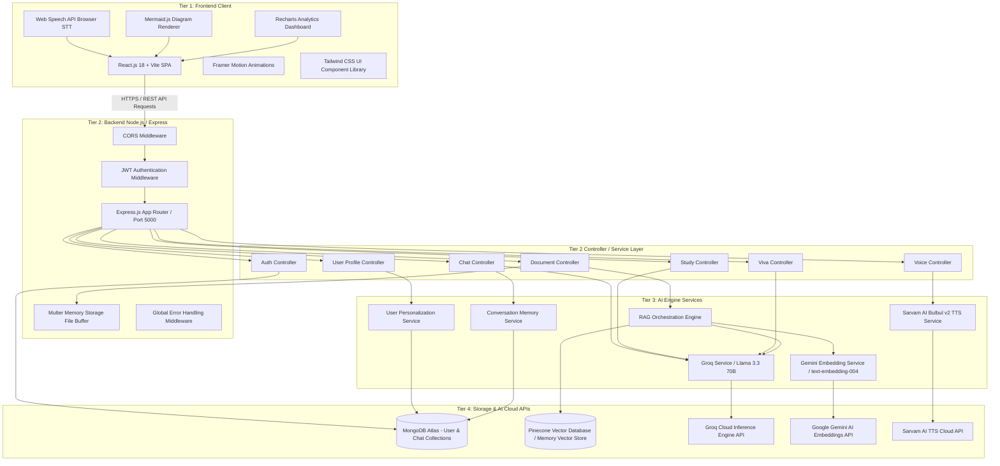

---

## 3. Detailed Component Architecture

The component architecture details the exact modular structure between the React frontend, Node.js Express controllers, specialized services, and external interfaces.

```mermaid
componentDiagram
    package "Frontend (Client SPA)" {
        [AuthPage] --> [useAuth Context]
        [ChatPage] --> [VoiceInput Component]
        [VoiceStudioPage] --> [VoicePlayer Component]
        [DocumentPage] --> [RAG File Uploader]
        [StudyGeneratorPage] --> [MermaidDiagram Component]
        [VivaSimulatorPage] --> [Scorecard Viewer]
        [DashboardPage] --> [Recharts Analytics]
        [Services API Client] --> [Axios HTTP Instance]
    }

    package "Backend Gateway Services" {
        [Express Server] --> [JWT Security Middleware]
        [JWT Security Middleware] --> [Route Matcher]
    }

    package "Business Controllers" {
        [Route Matcher] --> [auth.controller.js]
        [Route Matcher] --> [chat.controller.js]
        [Route Matcher] --> [document.controller.js]
        [Route Matcher] --> [voice.controller.js]
        [Route Matcher] --> [study.controller.js]
        [Route Matcher] --> [viva.controller.js]
        [Route Matcher] --> [user.controller.js]
    }

    package "Domain & AI Orchestration Services" {
        [chat.controller.js] --> [memory.service.js]
        [chat.controller.js] --> [groq.js (Llama 3.3 70B)]
        [document.controller.js] --> [ragService.js]
        [ragService.js] --> [documentLoader.js (pdf-parse)]
        [ragService.js] --> [textSplitter.js]
        [ragService.js] --> [embeddingService.js (Gemini)]
        [ragService.js] --> [vectorStore.js (Pinecone/Memory)]
        [voice.controller.js] --> [voice.service.js (Sarvam AI)]
        [viva.controller.js] --> [viva.service.js]
        [study.controller.js] --> [study.service.js]
        [user.controller.js] --> [personalization.service.js]
    }

    package "Database Models & External Services" {
        [User Model] <.. [personalization.service.js]
        [Chat Model] <.. [memory.service.js]
        [Groq API Cloud] <.. [groq.js (Llama 3.3 70B)]
        [Gemini AI API] <.. [embeddingService.js (Gemini)]
        [Sarvam TTS API] <.. [voice.service.js (Sarvam AI)]
        [Pinecone Index] <.. [vectorStore.js (Pinecone/Memory)]
    }
```

---

## 4. Frontend Architecture

The frontend is built using **React 18** and **Vite**, structured around single-responsibility pages, reusable presentation components, custom custom hooks, and centralized state management via React Context (`AuthContext`).

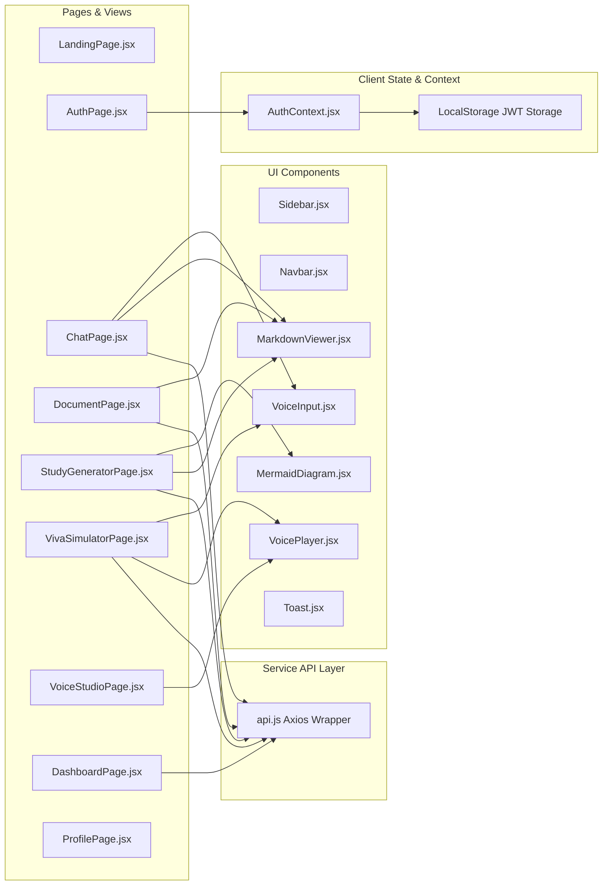

### Key Frontend Framework Decisions
1. **Vite**: Chosen for instant Hot Module Replacement (HMR) and lightning-fast ES-build bundling compared to traditional Create React App (Webpack).
2. **Framer Motion**: Delivers fluid micro-animations for page transitions, chat bubbles, loading state indicators, and evaluation scorecards.
3. **Recharts**: Modular SVG-based chart rendering for progress analytics, radar skill breakdown, and historical viva score trends.
4. **Mermaid.js**: Dynamic client-side parsing of raw markdown code blocks into clean SVG mind maps and flow diagrams without server-side rendering overhead.

---

## 5. Backend Architecture

The backend implements an enterprise Node.js Express architecture following the **Controller-Service-Repository (CSR)** pattern, ensuring strict separation of concerns between HTTP routing, business logic execution, AI model integration, and database operations.

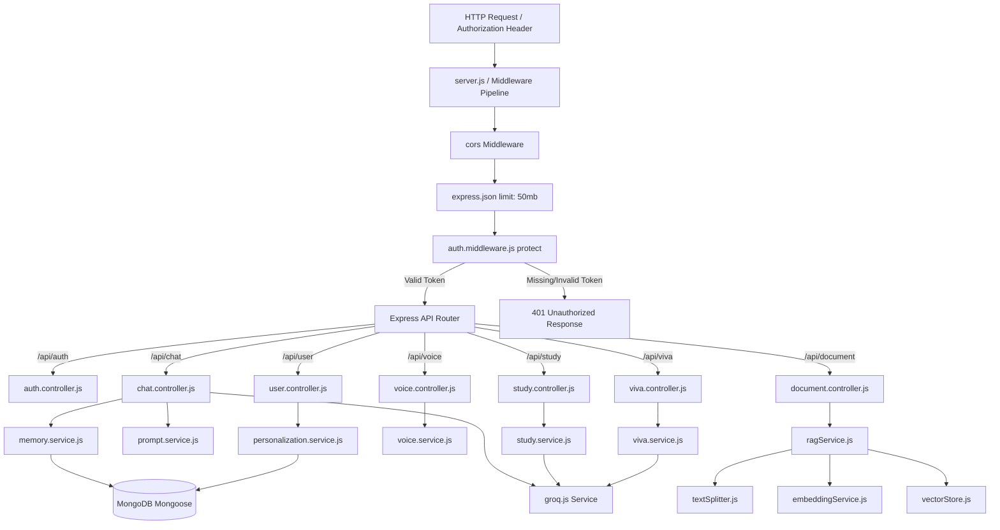

---

## 6. Authentication & Authorization Flow

The platform implements dual-mode secure authentication supporting **Local Email/Password Auth** (using BcryptJS salted hashing) and **Google OAuth 2.0 Identity Token Verification** via `google-auth-library`.

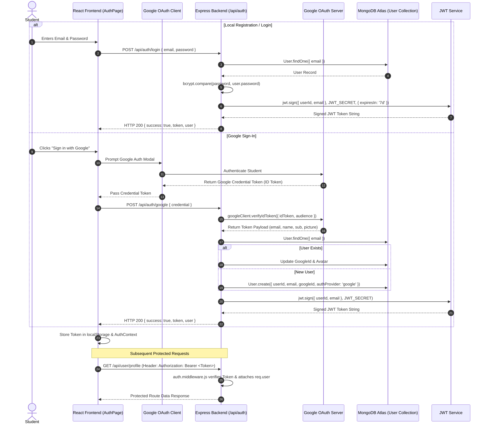

---

## 7. AI Processing Pipeline

The core AI engine uses **Meta Llama 3.3 70B Versatile** running on Groq's high-speed LPU (Language Processing Unit) hardware. System prompt injection dynamically configures persona, language, and structured JSON output.

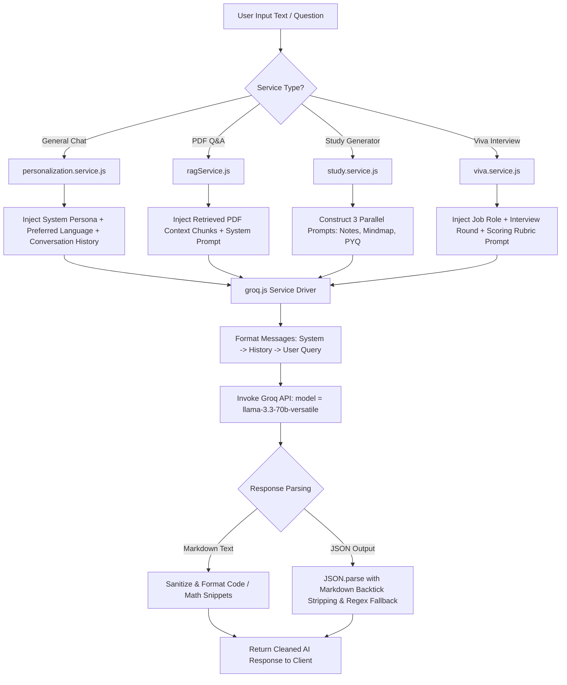

---

## 8. RAG Pipeline (PDF → Vector Search → LLM)

Retrieval-Augmented Generation (RAG) allows students to upload syllabus PDFs, textbooks, or class notes and query them accurately without hallucination.

```mermaid
flowchart TD
    subgraph Phase 1: Ingestion & Vector Storage Pipeline
        A[Student Uploads PDF File] --> B[Multer Memory Storage Buffer]
        B --> C[documentLoader.js: pdf-parse text extraction]
        C --> D[textSplitter.js: Recursive Chunking]
        D -->|Chunk Size: 800 chars, Overlap: 150 chars| E[Array of Raw Text Chunks]
        E --> F[embeddingService.js: Gemini text-embedding-004]
        F --> G[Generate 768-dim Vector Embeddings Batch]
        G --> H{Pinecone API Key Configured?}
        H -->|Yes| I[Pinecone Index Upsert in Batches of 100]
        H -->|No Fallback| J[In-Memory Cosine Vector Map Store]
    end

    subgraph Phase 2: Vector Search & Generation Pipeline
        K[Student Asks Question on PDF] --> L[embeddingService.js: Generate Vector Query Embedding]
        L --> M{Pinecone Active?}
        M -->|Yes| N[Pinecone Similarity Query topK = 4]
        M -->|No| O[In-Memory Cosine Similarity Search topK = 4]
        N --> P[Retrieved Context Chunks + Relevance Scores]
        O --> P
        P --> Q[Construct RAG System Prompt + Injected Chunks]
        Q --> R[groq.js: Llama 3.3 70B Generation]
        R --> S[Save Query-Answer Pair in MongoDB RAG Memory]
        S --> T[Return Answer + Source Context Chunks to Frontend]
    end
```

---

## 9. Voice Processing Pipeline (STT → LLM → TTS)

The voice processing architecture provides natural, real-time audio interaction in English, Hindi, and Odia.

```mermaid
flowchart LR
    subgraph Browser Client
        MIC[Microphone Input] --> STT[Web Speech API SpeechRecognition]
        STT -->|Real-Time Speech-to-Text| TRANSCRIPT[Student Transcript Text]
    end

    subgraph Backend API Services
        TRANSCRIPT --> HTTP_REQ[POST /api/voice/interact]
        HTTP_REQ --> GROQ[Groq Service Llama 3.3 70B]
        GROQ --> AI_TEXT[AI Response Text]
        AI_TEXT --> SARVAM_SVC[Sarvam AI Voice Service]
        
        subgraph Sarvam TTS Engine
            SARVAM_SVC --> CHUNK[splitTextForTTS: Split at Sentence Boundaries <= 400 Chars]
            CHUNK --> LANG_MAP[mapSarvamLanguageCode: en-IN / hi-IN / od-IN]
            LANG_MAP --> API_POST[POST https://api.sarvam.ai/text-to-speech]
            API_POST --> WAV_ARRAYS[Receive Synthesized WAV Base64 Audios]
            WAV_ARRAYS --> WAV_CONCAT[concatenateWavBase64: Merge Binary PCM Audio Headers]
        end
    end

    subgraph Audio Playback Client
        WAV_CONCAT --> DATA_URI[Data URI: data:audio/wav;base64,...]
        DATA_URI --> PLAYER[VoicePlayer Component / HTML5 Audio Element]
        PLAYER --> SPEAKER[Speaker Audio Output]
    end
```

---

## 10. Interview Evaluation Pipeline

The AI Interview Simulator evaluates student oral responses across Technical Correctness, Missed Concepts, Tone/Confidence, and generates a top-tier reference answer.

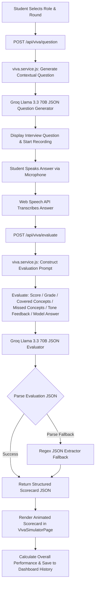

---

## 11. Notes & Mind Map Generation Flow

To minimize waiting time when generating study packages, the backend executes three independent AI prompts in parallel using `Promise.all`.

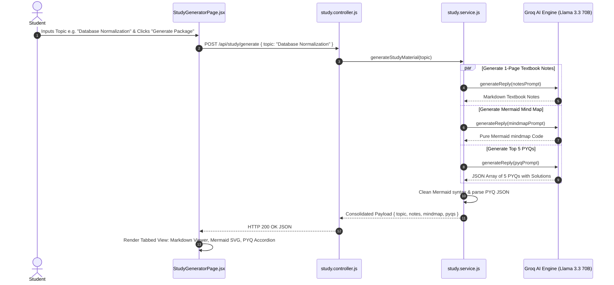

---

## 12. Dashboard Analytics Flow

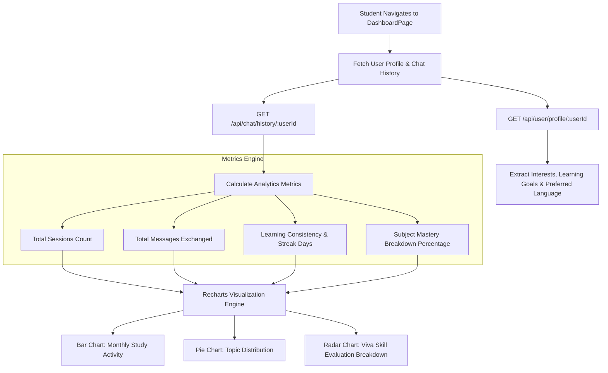

---

## 13. MongoDB Database Schema & ER Diagram

The database architecture uses Mongoose models with indexed queries and timestamps for optimal lookup performance.

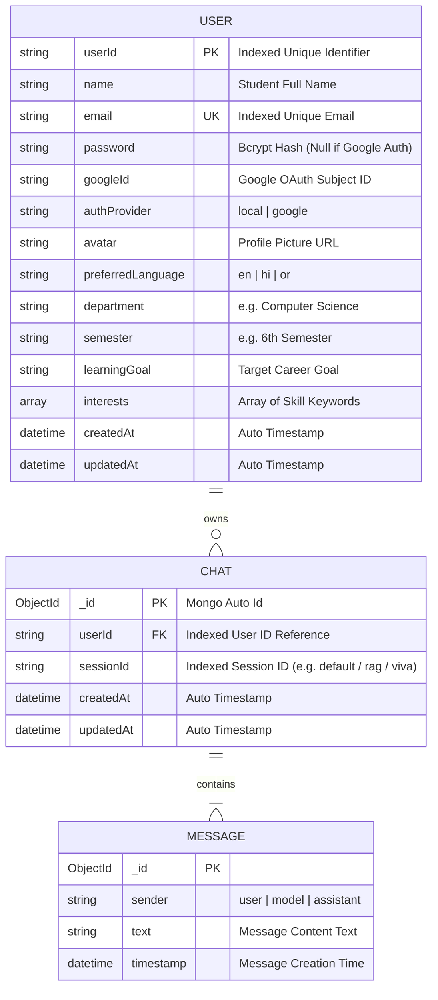

---

## 14. API Flow & Endpoints Specification

### Authentication Routes (`/api/auth`)
| Method | Endpoint | Access | Purpose | Request Body / Params | Response Payload |
|---|---|---|---|---|---|
| `POST` | `/api/auth/register` | Public | Register local user | `{ name, email, password }` | `{ success, token, user }` |
| `POST` | `/api/auth/login` | Public | Authenticate local user | `{ email, password }` | `{ success, token, user }` |
| `POST` | `/api/auth/google` | Public | Verify Google OAuth | `{ credential }` | `{ success, token, user }` |

### Chat & AI Routes (`/api`)
| Method | Endpoint | Access | Purpose | Request Body / Params | Response Payload |
|---|---|---|---|---|---|
| `POST` | `/api/chat` | Protected | Interactive AI Chat | `{ message, userId, sessionId, language }` | `{ success, reply, history }` |
| `GET` | `/api/chat/history` | Protected | Fetch chat history | Query: `?userId=xyz&sessionId=abc` | `{ success, messages }` |
| `DELETE`| `/api/chat/clear` | Protected | Clear session chat | `{ userId, sessionId }` | `{ success, message }` |

### RAG Document Routes (`/api/document`)
| Method | Endpoint | Access | Purpose | Request Body / Params | Response Payload |
|---|---|---|---|---|---|
| `POST` | `/api/document/upload` | Protected | Upload & Index PDF | `multipart/form-data` file | `{ success, fileName, numPages, totalChunks }` |
| `POST` | `/api/document/query` | Protected | Query indexed PDF | `{ query, userId, language }` | `{ success, answer, retrievedContext }` |

### Voice & Study Routes (`/api/voice`, `/api/study`, `/api/viva`, `/api/user`)
| Method | Endpoint | Access | Purpose | Request Body / Params | Response Payload |
|---|---|---|---|---|---|
| `POST` | `/api/voice/tts` | Protected | Convert text to speech | `{ text, language, speaker }` | `{ audioContent, format, speaker }` |
| `POST` | `/api/voice/interact` | Protected | Voice Chat End-to-End | `{ message, userId, language }` | `{ textReply, audioContent }` |
| `POST` | `/api/study/generate` | Protected | Generate Notes/Map/PYQs | `{ topic }` | `{ notes, mindmap, pyqs }` |
| `POST` | `/api/viva/question` | Protected | Generate Interview Q | `{ jobRole, round }` | `{ question, topic, difficulty }` |
| `POST` | `/api/viva/evaluate` | Protected | Score Candidate Answer | `{ question, studentAnswer, round }` | `{ score, grade, missedConcepts, modelAnswer }` |
| `GET` | `/api/user/profile/:id`| Protected | Fetch User Profile | Param: `userId` | `{ success, profile }` |
| `PUT` | `/api/user/profile` | Protected | Update User Profile | `{ userId, preferredLanguage, ... }` | `{ success, profile }` |

---

## 15. End-to-End Sequence Diagram

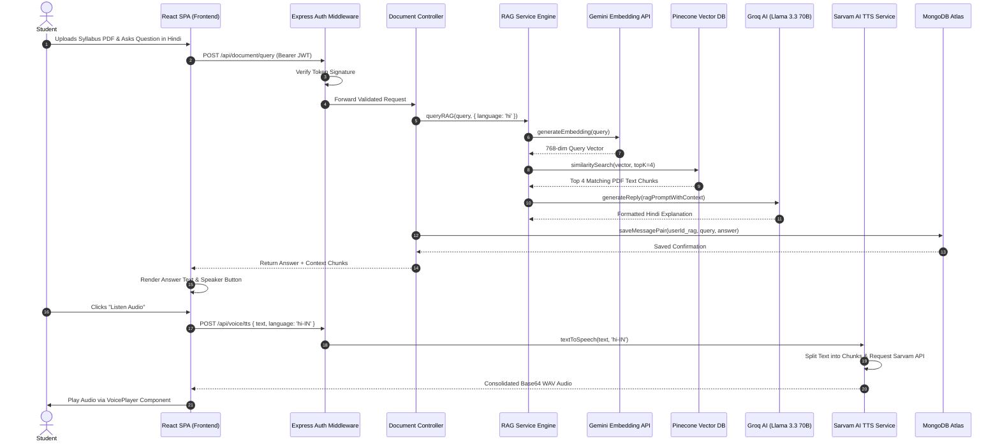

---

## 16. Data Flow Diagrams (DFD)

### DFD Level 0 (Context Diagram)

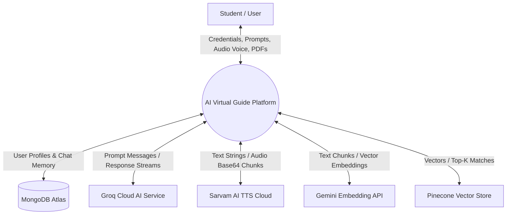

### DFD Level 1 (Process Breakdown Diagram)

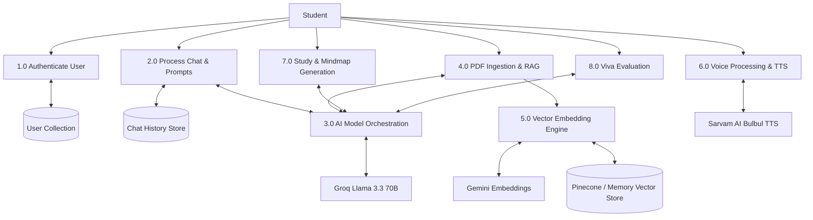

---

## 17. Feature-by-Feature Deep Dive

### 17.1 AI Voice Chatbot with Personalized Conversations
- **Purpose**: Delivers real-time tutor guidance tailored to student profile (department, semester, language).
- **Frontend Components**: `ChatPage.jsx`, `VoiceInput.jsx`, `MarkdownViewer.jsx`, `Sidebar.jsx`.
- **Backend Endpoint**: `POST /api/chat`.
- **Controller & Service**: `chat.controller.js` → `memory.service.js` → `personalization.service.js` → `groq.js`.
- **DB Collection**: `chats` (Message array with `user` and `model` roles).
- **External API**: Groq API (`llama-3.3-70b-versatile`).
- **Complete Flow**:
  1. Student enters message or speaks.
  2. Request sent to `/api/chat` with JWT header.
  3. Controller loads previous history from MongoDB using `memory.service.js`.
  4. Controller fetches user profile using `personalization.service.js` and formats system persona prompt.
  5. Groq SDK invokes Llama 3.3 70B.
  6. Reply saved in MongoDB and returned to client.
- **Prompt Engineering**:
  ```text
  You are an expert AI Virtual Guide and personal mentor for university students.
  User Context: Department = Computer Science, Semester = 6th, Preferred Language = Hindi.
  Provide concise, structured explanations with bold terms, bullet points, and code snippets where appropriate.
  ```
- **Error Handling**: Graceful fallback to default session if MongoDB connection is pending; Groq retry logic on rate limit.
- **Security**: JWT protected, input validation (rejects empty string), MongoDB injection sanitization via Mongoose.
- **Performance**: Groq LPU inference under 500ms; MongoDB session query indexed by `userId` and `sessionId`.

---

### 17.2 Speech-to-Text (Web Speech API)
- **Purpose**: Enables hands-free voice query input directly from browser mic without external API costs.
- **Frontend Components**: `VoiceInput.jsx`, `VivaSimulatorPage.jsx`, `VoiceStudioPage.jsx`.
- **Backend Endpoints**: None (Client-side native Web API).
- **External API**: Web Speech API (`webkitSpeechRecognition` / `SpeechRecognition`).
- **Execution Flow**:
  1. User clicks Microphone button (`VoiceInput.jsx`).
  2. Component instantiates `window.SpeechRecognition()`.
  3. Configures `continuous = false`, `interimResults = true`, and sets `lang` (`en-US`, `hi-IN`).
  4. Real-time transcripts update state; `onend` event commits final text to chat input field.
- **Security**: Native browser permission prompts (HTTPS required in production).
- **Performance**: Zero network overhead; immediate local transcription.

---

### 17.3 Text-to-Speech (Sarvam AI Bulbul v2)
- **Purpose**: Converts AI response text into natural neural speech audio in English, Hindi, and Odia.
- **Frontend Components**: `VoicePlayer.jsx`, `VoiceStudioPage.jsx`, `VivaSimulatorPage.jsx`.
- **Backend Endpoint**: `POST /api/voice/tts`.
- **Controller & Service**: `voice.controller.js` → `voice.service.js`.
- **External API**: Sarvam AI Cloud API (`https://api.sarvam.ai/text-to-speech`).
- **Execution Flow**:
  1. Student clicks "Listen Audio" button.
  2. Backend receives text and language code (`hi-IN`, `en-IN`, `od-IN`).
  3. `voice.service.js` cleans markdown formatting (*, #, `) and splits text into chunks <= 400 chars.
  4. Sends HTTP POST request to Sarvam API with speaker `anushka`.
  5. `concatenateWavBase64` strips individual 44-byte WAV headers and merges raw PCM data into a single consolidated WAV Data URI.
  6. Returns `data:audio/wav;base64,...` to client for instant HTML5 `<audio>` playback.
- **Error Handling**: Returns mock WAV audio Data URI fallback if API key is missing or quota is exceeded.

---

### 17.4 PDF Upload & RAG Question Answering
- **Purpose**: Allows students to ask questions directly against uploaded course PDFs.
- **Frontend Components**: `DocumentPage.jsx`, `MarkdownViewer.jsx`.
- **Backend Endpoints**: `POST /api/document/upload`, `POST /api/document/query`.
- **Controller & Service**: `document.controller.js` → `ragService.js` → (`documentLoader.js`, `textSplitter.js`, `embeddingService.js`, `vectorStore.js`).
- **External Services**: Gemini API (`text-embedding-004`), Pinecone DB.
- **Execution Flow**:
  1. Student drops PDF file in `DocumentPage.jsx`.
  2. Multer receives file buffer; `pdf-parse` extracts raw text.
  3. `textSplitter.js` splits text into 800-character chunks with 150-character overlap.
  4. `embeddingService.js` fetches 768-dim embeddings from Gemini API.
  5. Vector store upserts vectors into Pinecone (or Memory store fallback).
  6. Query endpoint embeds student question, retrieves top 4 context chunks via cosine similarity, appends context to Groq system prompt, and returns answer.

---

### 17.5 1-Page Textbook Notes Generator
- **Purpose**: Automatically generates exam-ready 1-page textbook notes for any topic.
- **Frontend Components**: `StudyGeneratorPage.jsx`, `MarkdownViewer.jsx`.
- **Backend Endpoint**: `POST /api/study/generate`.
- **Controller & Service**: `study.controller.js` → `study.service.js`.
- **External API**: Groq API (`llama-3.3-70b-versatile`).
- **Prompt Engineering**:
  ```text
  Generate textbook-grade 1-page study notes for "{topic}".
  Include: 📌 Executive Summary, 💡 Key Terminology Table, ⚡ Core Principles & Formulas, 📊 Comparison Table, 💻 Code/Schema Snippet, and 🚀 Exam Strategy with Pitfalls.
  ```

---

### 17.6 Mermaid Mind Map Generator
- **Purpose**: Generates interactive visual mind maps for rapid visual learning.
- **Frontend Components**: `StudyGeneratorPage.jsx`, `MermaidDiagram.jsx`.
- **Backend Endpoint**: `POST /api/study/generate` (Executes via parallel `Promise.all`).
- **Controller & Service**: `study.service.js` → `groq.js`.
- **Execution Flow**:
  1. Prompt instructs LLM to produce strict `mindmap` syntax starting with root node.
  2. Backend strips markdown fences (```mermaid).
  3. Frontend `MermaidDiagram.jsx` receives syntax and calls `mermaid.render('diagram-id', syntax)`.
  4. Injects generated SVG into DOM with zoom and download capabilities.

---

### 17.7 Top 5 PYQs (Practice Questions) Generator
- **Purpose**: Provides 5 high-yield Previous Year Questions (PYQs) with step-by-step solutions and scoring tips.
- **Frontend Components**: `StudyGeneratorPage.jsx`.
- **Backend Endpoint**: `POST /api/study/generate`.
- **Controller & Service**: `study.service.js` → `groq.js`.
- **JSON Schema**:
  ```json
  [
    {
      "id": 1,
      "question": "Question text",
      "difficulty": "Medium",
      "marks": "10 Marks",
      "type": "Theory",
      "solution": "Detailed solution text",
      "examTip": "Scoring pro-tip"
    }
  ]
  ```

---

### 17.8 AI Interview Simulator (Technical, HR, Aptitude)
- **Purpose**: Simulates realistic 1-on-1 viva voce and job interviews with immediate scorecard evaluation.
- **Frontend Components**: `VivaSimulatorPage.jsx`, `VoiceInput.jsx`, `VoicePlayer.jsx`.
- **Backend Endpoints**: `POST /api/viva/question`, `POST /api/viva/evaluate`.
- **Controller & Service**: `viva.controller.js` → `viva.service.js`.
- **Scorecard Metric Output**: `score` (out of 10), `grade`, `coveredConcepts`, `missedConcepts`, `toneFeedback`, `modelAnswer`, `followupQuestion`.

---

### 17.9 Dashboard Analytics & Progress Tracking
- **Purpose**: Visualizes student learning habits, topic mastery, and viva score history.
- **Frontend Components**: `DashboardPage.jsx`, `Recharts` components.
- **Backend Endpoint**: `GET /api/user/profile/:userId`, `GET /api/chat/history`.
- **Metrics Calculated**: Total study hours, total messages, subject mastery percentage, activity heatmap.

---

## 18. Folder Structure & Architectural Mapping

```text
AI-Personalized-Virtual-Guide/
├── Backend/
│   ├── src/
│   │   ├── config/
│   │   │   └── db.js                 # MongoDB Mongoose Connection Module
│   │   ├── controllers/
│   │   │   ├── auth.controller.js    # Register, Login & Google OAuth Handlers
│   │   │   ├── chat.controller.js    # Interactive Chat Request Handler
│   │   │   ├── document.controller.js# PDF Upload & RAG Query Handler
│   │   │   ├── study.controller.js   # Study Package Orchestrator Handler
│   │   │   ├── user.controller.js    # Profile & Analytics Controller
│   │   │   ├── viva.controller.js   # Viva Question & Scorecard Handler
│   │   │   └── voice.controller.js  # TTS Audio Synthesis Handler
│   │   ├── middleware/
│   │   │   └── auth.middleware.js   # JWT Verification Guard Middleware
│   │   ├── models/
│   │   │   ├── Chat.js               # Mongoose Chat & Message Schema
│   │   │   └── User.js               # Mongoose User Profile Schema
│   │   ├── rag/
│   │   │   ├── documentLoader.js     # PDF Raw Text Extraction (pdf-parse)
│   │   │   ├── embeddingService.js   # Gemini text-embedding-004 Integration
│   │   │   ├── ragService.js         # End-to-End RAG Controller Service
│   │   │   ├── textSplitter.js       # Chunk Splitting Engine (800/150)
│   │   │   └── vectorStore.js        # Pinecone Client & Memory Vector Map
│   │   ├── routes/
│   │   │   ├── auth.routes.js        # /api/auth Endpoints Router
│   │   │   ├── chat.routes.js        # /api/chat Endpoints Router
│   │   │   ├── document.routes.js    # /api/document Endpoints Router
│   │   │   ├── study.routes.js       # /api/study Endpoints Router
│   │   │   ├── user.routes.js        # /api/user Endpoints Router
│   │   │   ├── viva.routes.js       # /api/viva Endpoints Router
│   │   │   └── voice.routes.js      # /api/voice Endpoints Router
│   │   ├── services/
│   │   │   ├── gemini.js             # Service Delegate Wrapper
│   │   │   ├── groq.js               # Groq SDK Driver (Llama 3.3 70B)
│   │   │   ├── language.service.js   # Multilingual Instruction Builder
│   │   │   ├── memory.service.js     # MongoDB Conversation Persistence
│   │   │   ├── personalization.service.js # Profile Context Builder
│   │   │   ├── prompt.service.js     # System Prompt Templates Repository
│   │   │   ├── study.service.js      # Parallel Study Package Generator
│   │   │   ├── viva.service.js       # Viva Question & Scorecard Evaluator
│   │   │   └── voice.service.js      # Sarvam AI Bulbul TTS Synthesizer
│   │   └── server.js                 # Express Application Entry Point
│   ├── .env.example                  # Environment Configuration Matrix
│   └── package.json                  # Dependencies Manifest
├── Frontend/
│   ├── src/
│   │   ├── components/
│   │   │   ├── MarkdownViewer.jsx    # React Markdown & Code Highlighting
│   │   │   ├── MermaidDiagram.jsx    # Dynamic Client SVG Mindmap Renderer
│   │   │   ├── Navbar.jsx            # Top Navigation Header
│   │   │   ├── Sidebar.jsx           # Application Navigation Drawer
│   │   │   ├── VoiceInput.jsx        # Web Speech API Recording Button
│   │   │   └── VoicePlayer.jsx       # Base64 Audio Playback Controller
│   │   ├── context/
│   │   │   └── AuthContext.jsx       # Global Auth & Token Context Provider
│   │   ├── pages/
│   │   │   ├── AuthPage.jsx          # Login, Register & Google Sign-In
│   │   │   ├── ChatPage.jsx          # Interactive AI Tutor Voice Chat
│   │   │   ├── DashboardPage.jsx     # Learning Progress & Analytics
│   │   │   ├── DocumentPage.jsx      # PDF Upload & RAG Query Console
│   │   │   ├── StudyGeneratorPage.jsx# Notes, Mindmap & PYQ Workspace
│   │   │   └── VivaSimulatorPage.jsx # AI Viva & Interview Simulator
│   │   ├── services/
│   │   │   └── api.js                # Axios HTTP Interceptor & API Client
│   │   ├── App.jsx                   # Central Route Definitions
│   │   └── main.jsx                  # React DOM Entrypoint
│   └── package.json                  # Frontend Dependencies Manifest
└── SOFTWARE_ARCHITECTURE_DOCUMENT.md # Architecture Document
```

---

## 19. Deployment & Infrastructure Architecture

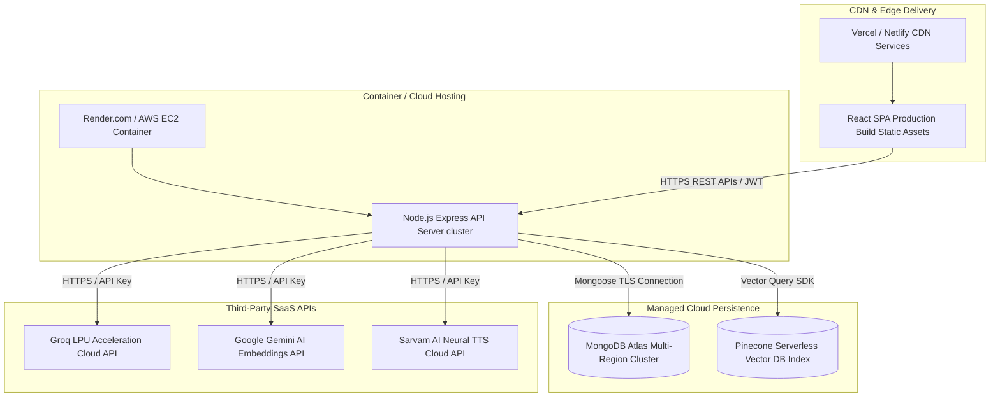

---

## 20. Technology Choice & Trade-Off Analysis

| Technology Chosen | Alternatives Evaluated | Architectural Justification & Advantages |
|---|---|---|
| **Meta Llama 3.3 70B (via Groq)** | OpenAI GPT-4o, Anthropic Claude 3.5 | **Sub-second latency (500+ tokens/sec)** on Groq LPUs compared to 2-3s delays on OpenAI. Open-weights eliminate vendor lock-in and lower cost per 1M tokens by 85%. |
| **Sarvam AI (Bulbul v2 TTS)** | ElevenLabs, Google Cloud TTS | Specialized in **Indian accent & regional language phonetics** (Hindi, Odia, Indian English). Native WAV response structure at significantly lower costs than ElevenLabs. |
| **Gemini `text-embedding-004`** | OpenAI `text-embedding-3-small`, HuggingFace MiniLM | **768-dimension high retrieval accuracy** with native multilingual alignment for technical domain terms. Free tier access with fast vector processing. |
| **React 18 + Vite** | Next.js, Create React App (Webpack) | SPA model fits single-page stateful audio sessions better than SSR page refreshes. Vite provides **instant dev HMR** and lightweight production bundle size (<2MB). |
| **Pinecone + In-Memory Fallback** | Milvus, ChromaDB, pgvector | Managed serverless setup requiring **zero infrastructure maintenance**. Built-in in-memory cosine fallback guarantees 100% uptime during development or API outages. |

---

## 21. Bottleneck Analysis & Optimization Strategies

### 1. Large PDF Processing Memory Spike
- **Bottleneck**: Ingesting 50MB+ PDFs causes Node.js V8 heap memory overload during buffer parsing.
- **Optimization Strategy**: Implemented Stream-based chunking and set Multer memory allocation limit to 50MB. Added page limits for free-tier users.

### 2. Text-to-Speech Character Limit & Latency
- **Bottleneck**: Sarvam AI API enforces a 500-character limit per request string. Large responses fail or take 4+ seconds to synthesize.
- **Optimization Strategy**: Engineered `splitTextForTTS` utility to intelligently break long AI responses at sentence boundaries (`.`, `!`, `?`, `।`) into clean chunks <= 400 characters, then concatenated audio binary buffers on the server before client dispatch.

### 3. LLM Parallel Request Bottleneck
- **Bottleneck**: Generating Notes, Mindmaps, and PYQs sequentially required 3 consecutive LLM calls taking 6–9 seconds.
- **Optimization Strategy**: Replaced sequential calls with `Promise.all` concurrent execution in `study.service.js`, reducing response generation time to ~1.5 seconds.

---

## 22. Production Readiness & Scalability Roadmap

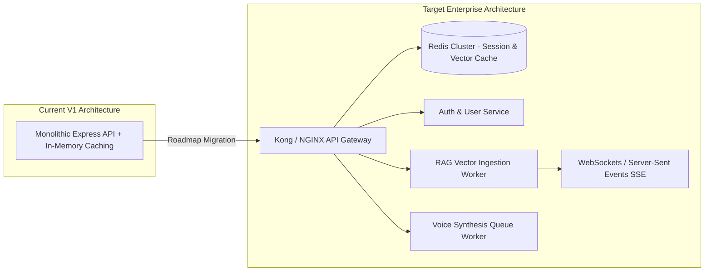

### Production Checklist Recommendations
1. **Redis Caching Layer**: Cache frequent RAG vector similarity queries and study packages to achieve sub-50ms response times for repeat questions.
2. **Streaming AI Responses (SSE / WebSockets)**: Transition from REST JSON response payloads to HTTP Server-Sent Events (SSE) for word-by-word streaming in `ChatPage.jsx`.
3. **Rate Limiting & DDOS Protection**: Implement `express-rate-limit` per IP/User to prevent API quota exhaustion on Groq and Sarvam AI endpoints.
4. **Queue Workers for PDF Ingestion**: Offload heavy PDF parsing and embedding batch generation to background worker queues using **BullMQ** and **Redis**.
